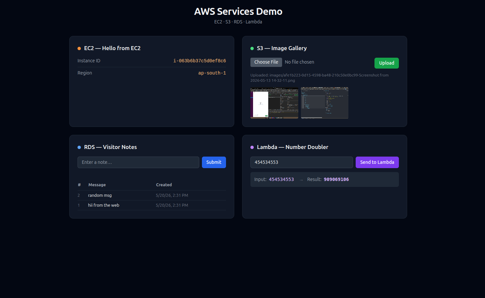

# AWS Services Demo Dashboard

Single-page Spring Boot app demonstrating EC2, S3, RDS, and Lambda integration.



## Stack

- Java 17 · Spring Boot 4 · Thymeleaf
- PostgreSQL (Spring Data JPA)
- AWS SDK for Java v2 (S3, Lambda)

## Cards

| Card | Service | What it does |
|------|---------|--------------|
| EC2 | EC2 IMDS | Shows instance ID + region via IMDSv2 |
| S3  | S3 | Upload images, view gallery with presigned URLs |
| RDS | PostgreSQL | Submit and list visitor notes |
| Lambda | Lambda | Sends a number, gets it doubled back |

## Local Setup

**1. Postgres**
```bash
createdb awsdemo
```

**2. AWS credentials** — edit `src/main/resources/application.properties`:
```properties
aws.access-key=YOUR_ACCESS_KEY
aws.secret-key=YOUR_SECRET_KEY
aws.s3.bucket=your-bucket-name
```

**3. Run**
```bash
./mvnw spring-boot:run
```
Open `http://localhost:8080`

> EC2 card shows "Not running on EC2 (local development)" locally — expected.

## AWS IAM Permissions

Attach to EC2 instance profile for production:

```json
{
  "Statement": [
    {
      "Effect": "Allow",
      "Action": "s3:ListBucket",
      "Resource": "arn:aws:s3:::your-bucket"
    },
    {
      "Effect": "Allow",
      "Action": ["s3:GetObject", "s3:PutObject"],
      "Resource": "arn:aws:s3:::your-bucket/*"
    },
    {
      "Effect": "Allow",
      "Action": "lambda:InvokeFunction",
      "Resource": "arn:aws:lambda:ap-south-1:*:function:numberDoubler"
    }
  ]
}
```

## S3 Bucket CORS

Required for presigned URL image preview:

```json
[{
  "AllowedHeaders": ["*"],
  "AllowedMethods": ["GET", "PUT"],
  "AllowedOrigins": ["*"],
  "ExposeHeaders": []
}]
```

## Lambda Function

Deploy this Python function as `numberDoubler` (runtime: Python 3.14):

```python
def handler(event, context):
    return {"result": event["number"] * 2}
```
